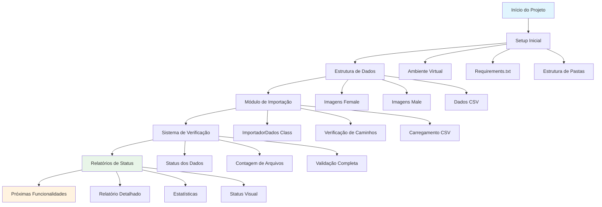

# Changelog

Histórico de desenvolvimento do Projeto INOVIA.

## Fluxo de Desenvolvimento



## Versões

### [0.1.0] - 2025-09-08 - Setup Inicial ✨

#### Adicionado
- **Estrutura base do projeto** com `main.py` como ponto de entrada
- **Módulo `importa_dados.py`** para gerenciamento de dados
- **Classe `ImportadorDados`** com funcionalidades completas:
  - Verificação automática de diretórios e arquivos
  - Carregamento e validação de dados CSV
  - Listagem de subpastas de imagens
  - Geração de estatísticas dos dados
  - Relatórios detalhados com status visual
- **Sistema de paths dinâmicos** usando pathlib
- **Configuração do ambiente** com requirements.txt
- **Documentação inicial** com README.md

#### Funcionalidades Implementadas
- ✅ Verificação automática de dados female/male
- ✅ Validação de arquivo CSV com medidas sintéticas
- ✅ Contagem de pastas e registros
- ✅ Relatórios coloridos com emojis
- ✅ Sistema modular e extensível

#### Estrutura de Dados Suportada
```
INOVIA_IMAGENS_female/    # Imagens sintéticas femininas
INOVIA_IMAGENS_male/      # Imagens sintéticas masculinas
medidas_dados_sinteticos.csv  # Dados de medidas
```

#### Próximos Passos
- [ ] Processamento de imagens
- [ ] Análise de dados sintéticos
- [ ] Algoritmos de medição
- [ ] Interface de usuário
- [ ] Testes automatizados

---

**Legenda:**
- ✨ Nova funcionalidade
- 🐛 Correção de bug
- 📝 Documentação
- 🔧 Manutenção
