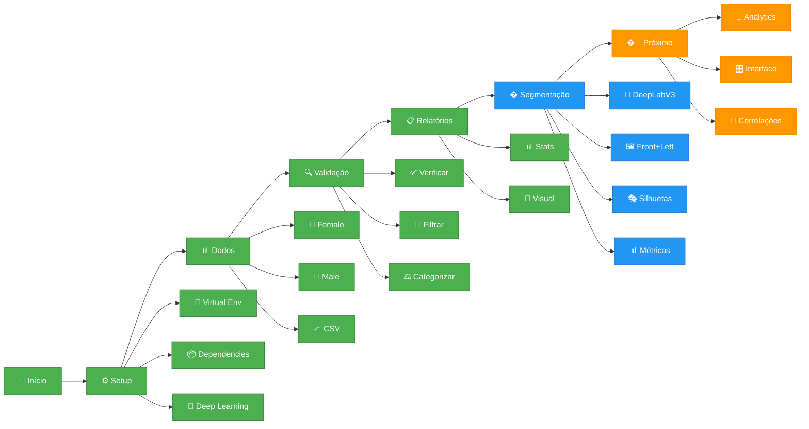

# Changelog

Histórico de desenvolvimento do Projeto INOVIA.

## Fluxo de Desenvolvimento



## Versões

### [0.2.0] - 2025-09-08 - Processamento de Imagens 🖼️

#### 🚀 NOVO: Sistema de Segmentação de Imagens
- **🤖 Modelo DeepLabV3** com backbone ResNet50 para segmentação semântica
- **🎯 Detecção automática** de pessoas em imagens (front.png + left.png)
- **🔧 Pipeline otimizada** com pré/pós-processamento avançado
- **📊 Estatísticas de segmentação** (área, percentuais, qualidade)
- **👁️ Visualização interativa** de silhuetas processadas

#### 🛠️ Tecnologias Avançadas
- **🔥 PyTorch + Torchvision** para Deep Learning
- **🎨 OpenCV** para processamento de imagens
- **⚡ CUDA** support para aceleração GPU
- **🎛️ Hiperparâmetros ajustáveis** (threshold, área mínima, etc.)
- **📦 Requirements expandidos** com dependências DeepLearning

#### 💾 Dependências Adicionadas
```text
torch>=2.0.0              # Motor PyTorch
torchvision>=0.15.0        # Modelos pré-treinados
opencv-python>=4.8.0       # Processamento de imagens
scipy>=1.11.0              # Computação científica
scikit-learn>=1.3.0        # Machine Learning utils
pydensecrf>=1.0.2          # Refinamento de segmentação
```

#### 🏗️ Arquitetura Modular Expandida
```python
ModeloSegmentacao():
├── processar_dataset()           # 🔄 Pipeline completa
├── processar_variavel()         # 📁 Por ID/pasta
├── _processar_imagem()          # 🖼️ Imagem individual
├── _calcular_estatisticas()     # 📊 Métricas de qualidade
└── salvar_resultados()          # 💾 Exportar resultados

SegmentacaoPessoa():
├── segmentar_pessoa()           # 🎯 Segmentação principal
├── melhorar_contraste()         # ✨ Pré-processamento
├── pos_processar_mascara()      # 🔧 Limpeza de ruído
├── visualizar_resultados()      # 👁️ Exibição interativa
└── extrair_silhueta()           # 🎭 Silhueta isolada
```

### [0.1.0] - 2025-09-08 - Base Sólida ✨

#### 🔥 Implementado
- **🎯 Arquitetura modular** com `main.py` como coordenador
- **📊 Sistema ImportadorDados** para gerenciamento inteligente
- **🔍 Validação automática** de dados CSV ↔ Pastas de imagens
- **⚖️ Categorização inteligente** por gênero e posição (Pre/Pos)
- **📋 Relatórios visuais** com estatísticas em tempo real

#### 🏗️ Funcionalidades Core
```python
ImportadorDados():
├── verificar_dados()          # ✅ Paths e arquivos
├── carregar_dados_csv()       # 📄 Leitura segura
├── filtrar_dados_validos()    # 🎯 Correspondência
├── filtrar_por_genero_posicao() # ⚖️ Categorias
└── imprimir_relatorio()       # 📊 Status visual
```

#### 📊 Estrutura Suportada
```
syn_fXXXXXX-X-Pre/    # 👩 Female Pre
syn_fXXXXXX-X-Pos/    # 👩 Female Pos  
syn_mXXXXXX-X-Pre/    # 👨 Male Pre
syn_mXXXXXX-X-Pos/    # 👨 Male Pos
```

#### 🔮 Roadmap
- ✅ **v0.1** - Base de dados sólida
- ✅ **v0.2** - Segmentação de imagens
- 🔄 **v0.3** - Analytics e correlações  
- 🛣️ **v0.4** - Interface gráfica
- 🚀 **v0.5** - Deploy e produção
