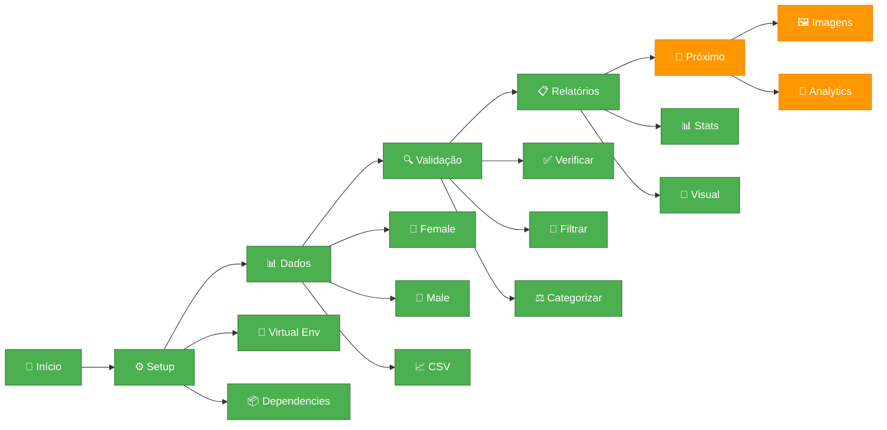

# Changelog

Histórico de desenvolvimento do Projeto INOVIA.

## Fluxo de Desenvolvimento



## Versões

### [0.1.0] - 2025-09-08 - Base Sólida ✨

#### 🔥 Implementado
- **🎯 Arquitetura modular** com `main.py` como coordenador
- **📊 Sistema ImportadorDados** para gerenciamento inteligente
- **🔍 Validação automática** de dados CSV ↔ Pastas de imagens
- **⚖️ Categorização inteligente** por gênero e posição (Pre/Pos)
- **📋 Relatórios visuais** com estatísticas em tempo real

#### 🏗️ Funcionalidades Core
```python
ImportadorDados():
├── verificar_dados()          # ✅ Paths e arquivos
├── carregar_dados_csv()       # 📄 Leitura segura
├── filtrar_dados_validos()    # 🎯 Correspondência
├── filtrar_por_genero_posicao() # ⚖️ Categorias
└── imprimir_relatorio()       # 📊 Status visual
```

#### 📊 Estrutura Suportada
```
syn_fXXXXXX-X-Pre/    # 👩 Female Pre
syn_fXXXXXX-X-Pos/    # 👩 Female Pos  
syn_mXXXXXX-X-Pre/    # 👨 Male Pre
syn_mXXXXXX-X-Pos/    # 👨 Male Pos
```

#### 🔮 Roadmap
- 🖼️ **v0.2** - Processamento de imagens
- 🧮 **v0.3** - Analytics e correlações  
- 🎛️ **v0.4** - Interface gráfica
