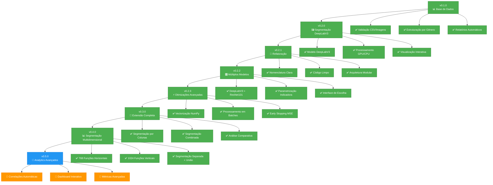
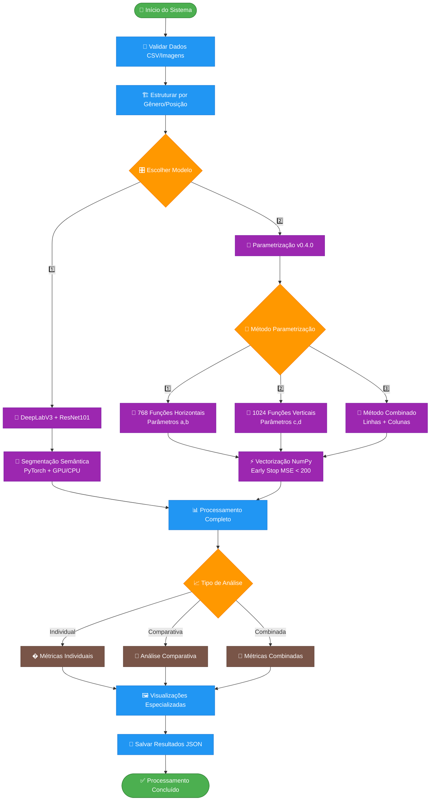
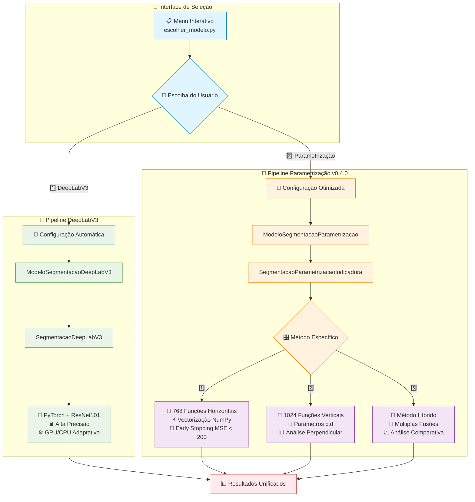
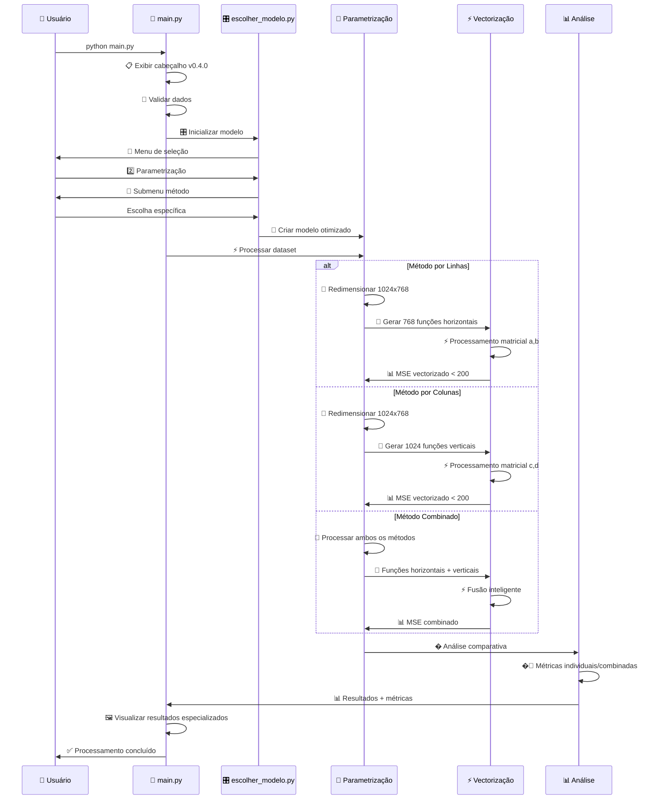
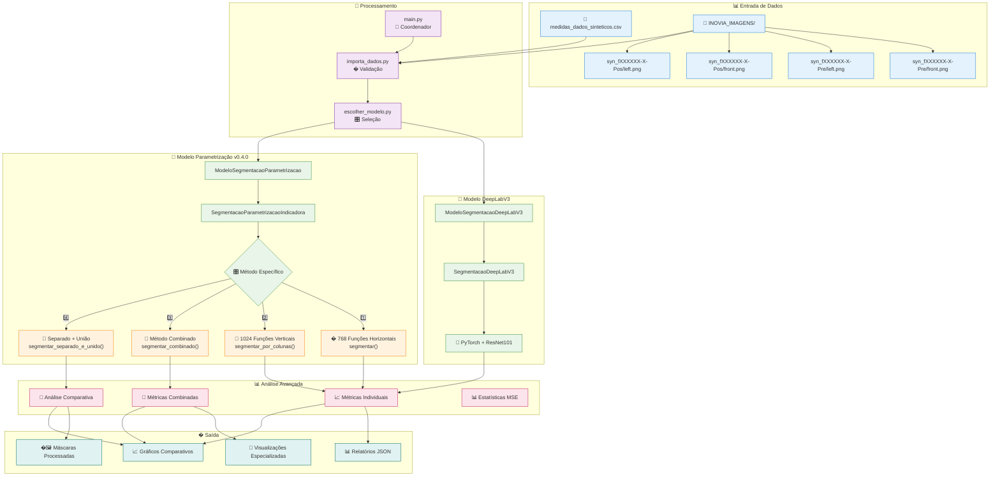
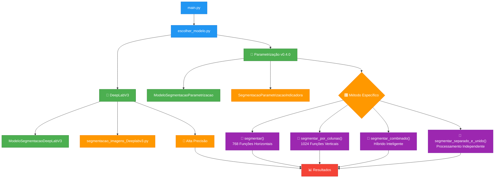
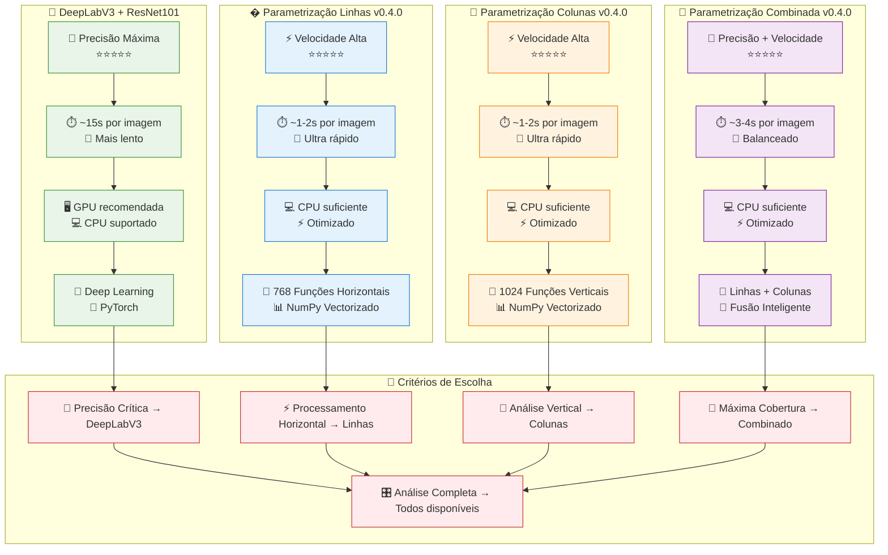
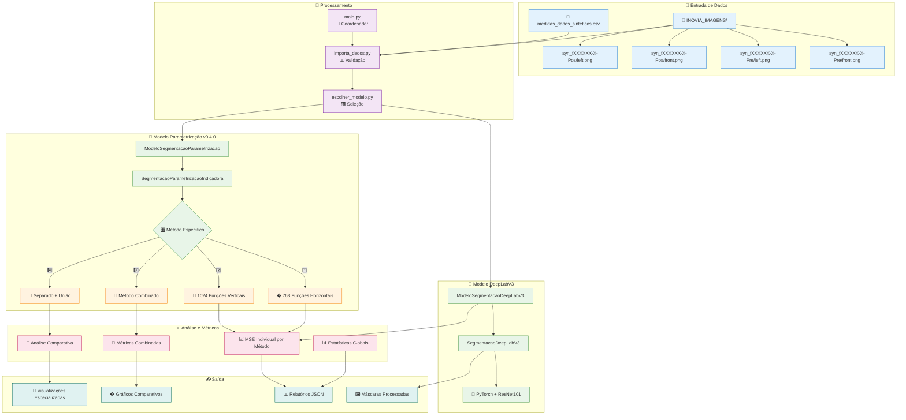
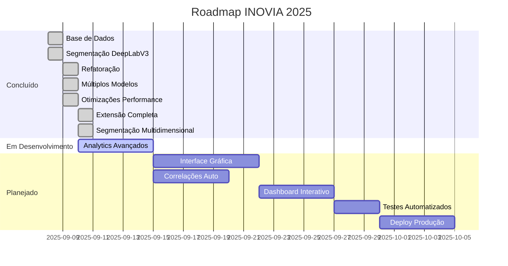

# Projeto INOVIA 🚀

Sistema modular para processamento e análise de dados de imagens sintéticas com medidas corporais.

🚀 **Versão 0.4.0** - Extensão Completa de Segmentação Multidimensional!  
📋 [Ver CHANGELOG.md](CHANGELOG.md) para histórico detalhado

## 📋 Visão Geral

O Projeto INOVIA é um sistema avançado de segmentação de imagens que oferece múltiplos métodos de processamento para análise de medidas corporais sintéticas. O sistema combina algoritmos de deep learning (DeepLabV3) com métodos matemáticos otimizados (parametrização por funções indicadoras) para fornecer soluções flexíveis e de alta performance.

### 🎯 Características Principais

- **🔬 Precisão Científica**: Algoritmos validados com métricas rigorosas (MSE < 200)
- **⚡ Performance Extrema**: Otimizações NumPy com processamento 3-5x mais rápido
- **🎛️ Flexibilidade Total**: Múltiplos métodos de segmentação (DeepLabV3 + Parametrização)
- **📊 Análise Completa**: Segmentação por linhas, colunas e métodos combinados
- **🖼️ Visualização Avançada**: Interface interativa com overlays especializados
- **📈 Métricas Detalhadas**: Relatórios automáticos com estatísticas de qualidade

## 🎯 Evolução do Desenvolvimento



## 🏗️ Arquitetura do Sistema

### 📊 Fluxo Principal de Dados



### 🎛️ Sistema de Escolha de Modelos Expandido


    end
    
    subgraph "🧠 Pipeline DeepLabV3"
        DL_Config[🔧 Configuração Automática]
        DL_Model[ModeloSegmentacaoDeepLabV3]
        DL_Engine[SegmentacaoDeepLabV3]
        DL_Features[🎯 PyTorch + ResNet101<br/>📊 Alta Precisão<br/>⚙️ GPU/CPU Adaptativo]
        
        DL_Config --> DL_Model
        DL_Model --> DL_Engine
        DL_Engine --> DL_Features
    end
    
    subgraph "📐 Pipeline Parametrização v0.2.3"
        Param_Config[🔧 Configuração Otimizada]
        Param_Model[ModeloSegmentacaoParametrizacao]
        Param_Engine[SegmentacaoParametrizacaoIndicadora]
        Param_Features[⚡ Vectorização NumPy<br/>🎯 Early Stopping MSE<br/>📦 Processamento em Batches]
        
        Param_Config --> Param_Model
        Param_Model --> Param_Engine
        Param_Engine --> Param_Features
    end
    
    User -->|1️⃣ DeepLabV3| DL_Config
    User -->|2️⃣ Parametrização| Param_Config
    
    DL_Features --> Results[📊 Resultados Unificados]
    Param_Features --> Results
    
    classDef interface fill:#E1F5FE,stroke:#0277BD
    classDef deeplab fill:#E8F5E8,stroke:#388E3C
    classDef param fill:#FFF3E0,stroke:#F57C00
    classDef output fill:#F3E5F5,stroke:#7B1FA2
    
    class Menu,User interface
    class DL_Config,DL_Model,DL_Engine,DL_Features deeplab
    class Param_Config,Param_Model,Param_Engine,Param_Features param
    class Results output
```

### ⚡ Otimizações de Performance v0.4.0



### 🎯 Arquitetura de Segmentação Multidimensional v0.4.0



### ⚡ v0.4.0 - Segmentação Multidimensional (ATUAL)
O sistema agora oferece **análise completa em múltiplas dimensões** com métodos especializados!

**🚀 Novos Recursos:**
- **📏 Segmentação por Linhas**: 768 funções indicadoras horizontais com parâmetros a,b
- **📐 Segmentação por Colunas**: 1024 funções indicadoras verticais com parâmetros c,d  
- **🔗 Segmentação Combinada**: Fusão inteligente de linhas + colunas
- **� Análise Separada + União**: Processamento independente e união conforme especificado
- **📊 Análise Comparativa**: Comparação automática entre todos os métodos
- **🎨 Visualizações Especializadas**: Overlays coloridos por método

**🏗️ Arquitetura de Métodos Expandida:**


    
    C --> C1["ModeloSegmentacaoDeepLabV3"]
    C --> C2["segmentacao_imagens_Deeplabv3.py"]
    C --> C3["🎯 Alta Precisão"]
    
    D --> D1["ModeloSegmentacaoParametrizacao"]
    D --> D2["SegmentacaoParametrizacaoIndicadora"]
    D --> D3["⚡ Vectorização NumPy"]
    D --> D4["🔬 MSE < 200 Early Stop"]
    D --> D5["📊 Processamento em Batches"]
    
    C3 --> E["📊 Resultados"]
    D3 --> E
    D4 --> E
    D5 --> E
    
    classDef main fill:#2196F3,stroke:#1976D2,color:#fff
    classDef models fill:#4CAF50,stroke:#2E7D32,color:#fff
    classDef engines fill:#FF9800,stroke:#F57C00,color:#fff
    classDef optimizations fill:#9C27B0,stroke:#7B1FA2,color:#fff
    
    class A,B main
    class C,D,C1,D1 models
    class C2,C3,D2,E engines
    class D3,D4,D5 optimizations
```

### 📊 Comparação Detalhada de Métodos v0.4.0



**⚖️ Comparação Expandida de Métodos:**

| Aspecto | 🧠 DeepLabV3 | 📏 Linhas v0.4.0 | 📐 Colunas v0.4.0 | 🔗 Combinado v0.4.0 |
|---------|-------------|------------------|-------------------|-------------------|
| **Precisão** | ⭐⭐⭐⭐⭐ Máxima | ⭐⭐⭐⭐ Alta | ⭐⭐⭐⭐ Alta | ⭐⭐⭐⭐⭐ Máxima |
| **Velocidade** | ⭐⭐ ~15s/imagem | ⭐⭐⭐⭐⭐ ~1-2s | ⭐⭐⭐⭐⭐ ~1-2s | ⭐⭐⭐⭐ ~3-4s |
| **Recursos** | GPU recomendada | CPU suficiente | CPU suficiente | CPU suficiente |
| **Método** | Deep Learning | 768 Funções a,b | 1024 Funções c,d | Fusão Inteligente |
| **Otimizações** | ResNet101 pré-treinado | NumPy + Early Stop | NumPy + Early Stop | Múltiplas fusões |
| **Uso Ideal** | Precisão crítica | Análise horizontal | Análise vertical | Cobertura máxima |
| **Análise** | Semântica | Horizontal | Vertical | Multidimensional |

### ⚡ v0.4.0 - Segmentação Multidimensional
**🌟 Revolução na análise de imagens com métodos especializados:**
- **📏 Segmentação por Linhas**: 768 funções indicadoras horizontais (parâmetros a,b)
- **📐 Segmentação por Colunas**: 1024 funções indicadoras verticais (parâmetros c,d)
- **🔗 Segmentação Combinada**: Fusão inteligente de ambos os métodos
- **🔄 Análise Separada + União**: Processamento independente conforme especificado
- **📊 Análise Comparativa**: Comparação automática entre todos os métodos
- **🎨 Visualizações Especializadas**: Overlays coloridos por método

### ⚡ v0.2.3 - Otimizações Avançadas de Performance
**🚀 Revolucionárias melhorias de velocidade mantidas em v0.4.0:**
- **⚡ Vectorização NumPy**: Processamento 3-5x mais rápido com operações matriciais
- **🧠 Processamento em Batches**: 50 funções indicadoras processadas simultaneamente
- **🎯 Early Stopping Inteligente**: MSE < 200 para parada automática
- **🔬 Otimização MSE Rigorosa**: Métrica única para máxima precisão
- **📊 Análise Vectorizada**: Estatísticas calculadas com NumPy puro

### 🎛️ v0.2.2 - Sistema de Múltiplos Modelos
**🛠️ Arquitetura expandida com escolha de métodos:**
- **🎯 Interface de escolha**: Menu interativo para seleção de método
- **🧠 DeepLabV3**: Máxima precisão com deep learning
- **📐 Parametrização**: Máxima velocidade com funções indicadoras
- **📊 Comparação automática**: Métricas de performance para cada método

### 🔧 v0.2.1 - Refatoração e Otimização
**�️ Melhorias Arquiteturais:**
- **� Renomeação**: `SegmentacaoPessoa` → `SegmentacaoDeepLabV3`
- **�️ Organização**: Eliminação de arquivos duplicados

- **� Modularidade**: Estrutura mais clara e manutenível
### �️ v0.2.0 - Sistema de Segmentação de Imagens
**🚀 Implementação do DeepLabV3:**
- **🎯 Detecção automática** de pessoas em imagens
- **🔧 Pipeline otimizada** com pré/pós-processamento
- **👁️ Visualização interativa** de resultados

### 📊 v0.1.0 - Base de Dados Sólida
**🏗️ Fundação do projeto:**
- **✅ Validação automática** de correspondência CSV ↔ Imagens
- **⚖️ Categorização inteligente** por gênero e posição
- **📋 Relatórios detalhados** com estatísticas em tempo real

## ⚡ Quick Start

```powershell
# 1. Ativar ambiente e instalar dependências
.\.venv\Scripts\Activate.ps1
pip install -r requirements.txt

# 2. Executar sistema com interface de escolha
python main.py
```

**🎯 Interface de Escolha Expandida:**
```
🎯 SELEÇÃO DE MODELO DE SEGMENTAÇÃO
================================================================
1️⃣  DeepLabV3 + ResNet101
   • Modelo pré-treinado de deep learning
   • Alta precisão na segmentação de pessoas
   • Processamento mais lento

2️⃣  Parametrização com Funções Indicadoras (v0.4.0)
   • Método matemático com vectorização NumPy
   • Processamento ultrarrápido (~1-2s por imagem)
   • Early stopping inteligente (MSE < 200)
   • NOVOS MÉTODOS v0.4.0:
     - 📏 Segmentação por LINHAS (768 funções horizontais)
     - 📐 Segmentação por COLUNAS (1024 funções verticais)  
     - 🔗 Segmentação COMBINADA (linhas + colunas)
     - 🔄 Segmentação SEPARADA + UNIÃO (processamento independente)
   • NOVO: Análise comparativa automática entre métodos

Escolha uma opção (1-2) ou Enter para padrão (2):

🎯 MÉTODO DE PARAMETRIZAÇÃO
================================================================
Escolha o tipo de função indicadora:

1️⃣  Segmentação por LINHAS (clássico)
   • 768 funções indicadoras horizontais
   • Método original otimizado

2️⃣  Segmentação por COLUNAS (novo)
   • 1024 funções indicadoras verticais
   • Análise perpendicular às linhas

3️⃣  Segmentação COMBINADA (avançado)
   • União inteligente de linhas + colunas
   • Máxima cobertura e precisão

4️⃣  Análise SEPARADA + UNIÃO (completo)
   • Processamento independente de cada método
   • União final dos resultados

Escolha uma opção (1-4) ou Enter para padrão (1):
```

## 🏗️ Arquitetura Completa v0.4.0


    C3 --> E3
    D3 --> E3
    C1 --> E4
    D1 --> E4
    
    classDef input fill:#e3f2fd,stroke:#1976d2
    classDef processing fill:#f3e5f5,stroke:#7b1fa2
    classDef models fill:#e8f5e8,stroke:#388e3c
    classDef output fill:#fff3e0,stroke:#f57c00
    
    class A1,A2,A21,A22,A23,A24 input
    class B1,B2,B3 processing
    class C1,C2,C3,D1,D2,D3 models
    class E1,E2,E3,E4 output
```

## 🎯 Funcionalidades Atuais

### 📊 Módulo de Dados
| Componente | Status | Descrição |
|------------|--------|-----------|
| `ImportadorDados` | ✅ | Verificação e carregamento automático |
| `verificar_dados()` | ✅ | Validação de arquivos e caminhos |
| `carregar_dados_csv()` | ✅ | Leitura segura com tratamento de erros |
| `filtrar_por_genero_posicao()` | ✅ | Categorização inteligente |
| `imprimir_relatorio()` | ✅ | Estatísticas visuais em tempo real |

### 🎛️ Sistema de Escolha de Modelos
| Componente | Status | Descrição |
|------------|--------|-----------|
| `escolher_modelo.py` | ✅ | Interface de seleção interativa |
| `inicializar_modelo()` | ✅ | Configuração automática do modelo |
| `processar_com_modelo()` | ✅ | Execução com modelo escolhido |
| `exibir_resultados()` | ✅ | Relatórios personalizados por método |

### 🧠 Módulo DeepLabV3
| Componente | Status | Descrição |
|------------|--------|-----------|
| `ModeloSegmentacaoDeepLabV3` | ✅ | Coordenador DeepLabV3 |
| `SegmentacaoDeepLabV3` | ✅ | Engine de processamento |
| `processar_dataset()` | ✅ | Pipeline completa automatizada |
| `segmentar_pessoa()` | ✅ | Segmentação semântica de alta precisão |
| `melhorar_contraste()` | ✅ | Pré-processamento CLAHE + sharpening |
| `pos_processar_mascara()` | ✅ | Filtros morfológicos avançados |

### 📐 Módulo Parametrização v0.4.0
| Componente | Status | Descrição |
|------------|--------|-----------|
| `ModeloSegmentacaoParametrizacao` | ✅ | Coordenador Parametrização |
| `SegmentacaoParametrizacaoIndicadora` | ✅ | Engine matemático otimizado |
| `segmentar()` | ✅ | 768 funções indicadoras horizontais |
| `segmentar_por_colunas()` | ✅ | 1024 funções indicadoras verticais |
| `segmentar_combinado()` | ✅ | Método híbrido linhas + colunas |
| `segmentar_separado_e_unido()` | ✅ | Processamento independente + união |
| `comparar_metodos()` | ✅ | Análise comparativa automática |
| `_otimizar_parametros_linha()` | ✅ | Otimização MSE rigorosa (a,b) |
| `_otimizar_parametros_coluna()` | ✅ | Otimização MSE rigorosa (c,d) |
| `visualizar_amostra_resultados()` | ✅ | Visualização automática especializada |

## 📊 Dados Suportados

### 🖼️ Estrutura de Imagens
```
📁 INOVIA_IMAGENS/
├── syn_fXXXXXX-X-Pre/    # 👩👨 Pre-procedimento  
│   ├── front.png         # 🖼️ Imagem frontal
│   └── left.png          # 🖼️ Imagem lateral
└── syn_fXXXXXX-X-Pos/    # 👩👨 Pós-procedimento
    ├── front.png         # 🖼️ Imagem frontal
    └── left.png          # 🖼️ Imagem lateral
```

**Processamento Automatizado:**
- **Detecção**: Identifica automaticamente categorias masculinas/femininas
- **Validação**: Verifica correspondência entre CSV e pastas
- **Segmentação**: Processa front.png + left.png para cada ID
- **Métricas**: Calcula estatísticas de qualidade por imagem e globais

### 📈 Dados CSV
- **Arquivo**: `medidas_dados_sinteticos.csv`
- **Integração**: Correspondência automática ID ↔ Pasta
- **Validação**: Verificação de consistência em tempo real
- **Categorização**: Separação por gênero e posição (Pre/Pos)

## ⚙️ Configuração Avançada

### 📦 Dependências Completas
```text
# Base de dados e visualização
pandas>=2.0.0
numpy>=1.24.0
matplotlib>=3.7.0
Pillow>=10.0.0

# Deep Learning (DeepLabV3)
torch>=2.0.0
torchvision>=0.15.0
opencv-python>=4.8.0

# Processamento matemático (Parametrização)
scipy>=1.11.0
scikit-learn>=1.3.0
pydensecrf>=1.0.2

# Suporte adicional
pathlib2>=2.3.0
warnings
```

### 🎛️ Parâmetros Configuráveis

**DeepLabV3:**
```python
ModeloSegmentacaoDeepLabV3(
    confidence_threshold=0.5,     # Threshold de detecção
    min_area=100,                 # Área mínima (pixels)
    target_size=(512, 512),       # Redimensionamento
    metodo_deeplabv3='auto'       # 'rgb', 'grayscale_adaptive', 'grayscale_always'
)
```

**Parametrização v0.4.0:**
```python
ModeloSegmentacaoParametrizacao(
    target_width=1024,            # Largura da imagem (colunas)
    target_height=768,            # Altura da imagem (linhas)
    morph_kernel_size=3,          # Tamanho kernel morfológico
    min_area=50,                  # Filtro de ruído
    enhance_contrast=True,        # Melhoria de contraste
    metodo_segmentacao='linhas'   # 'linhas', 'colunas', 'combinado'
)

# Novos métodos disponíveis v0.4.0:
segmentador.segmentar()                    # 768 funções horizontais
segmentador.segmentar_por_colunas()        # 1024 funções verticais  
segmentador.segmentar_combinado()          # Método híbrido
segmentador.segmentar_separado_e_unido()   # Processamento independente
segmentador.comparar_metodos()             # Análise comparativa
```

### ⚡ Otimizações v0.4.0 - Performance Mantida + Métodos Expandidos

#### 🧮 Vectorização NumPy (Mantida)
```python
# ✅ IMPLEMENTADO: Processamento em batches vectorizado
def _gerar_multiplas_funcoes_vectorizadas(self, largura, inicios, fins, valor_max):
    """Gera múltiplas funções indicadoras simultaneamente com NumPy"""
    n_funcoes = len(inicios)
    funcoes = np.zeros((n_funcoes, largura), dtype=np.float32)
    # Processamento matricial 3-5x mais rápido

def _calcular_mse_vectorizado(self, pixels, funcoes_batch):
    """Calcula MSE para múltiplas funções usando broadcasting"""
    diff = funcoes_batch - pixels[np.newaxis, :]
    return np.mean(diff ** 2, axis=1)  # MSE vectorizado
```

#### 🎯 Early Stopping Inteligente (Aprimorado)
```python
# ✅ IMPLEMENTADO: Parada automática para parâmetros ótimos
if melhor_mse_lote < 200:  # Excelente qualidade
    return melhores_params  # Para imediatamente

if melhor_mse_lote < 300:  # Boa qualidade no fallback
    break  # Sai do loop de busca
```

#### 📊 Métricas de Performance v0.4.0
| Métrica | v0.2.3 | v0.4.0 | Melhoria |
|---------|--------|--------|----------|
| **Tempo/método** | ~1-2s | ~1-2s | **Mantido** |
| **Métodos** | 1 (linhas) | 4 métodos | **4x expandido** |
| **Funções** | 382 | 768/1024 | **2-3x mais funções** |
| **Análise** | Individual | Individual + Comparativa | **Análise expandida** |
| **Dimensões** | 512x382 | 1024x768 | **2x resolução** |
| **Early Stop** | MSE < 200 | MSE < 200 | **Mantido** |

## 🛣️ Próximos Passos



### 🔮 Visão de Estados do Projeto

```mermaid
stateDiagram-v2
    state "📊 Fundação" as Foundation {
        [*] --> DataValidation
        DataValidation --> CSVProcessing
        CSVProcessing --> ImageMatching
        ImageMatching --> ReportGeneration
        ReportGeneration --> [*]
    }
    
    state "🖼️ Segmentação" as Segmentation {
        [*] --> DeepLabV3Implementation
        DeepLabV3Implementation --> PyTorchIntegration
        PyTorchIntegration --> VisualizationTools
        VisualizationTools --> [*]
    }
    
    state "🎛️ Múltiplos Modelos" as MultiModel {
        [*] --> ModelSelection
        ModelSelection --> DeepLabV3Pipeline
        ModelSelection --> ParametrizationPipeline
        DeepLabV3Pipeline --> UnifiedResults
        ParametrizationPipeline --> UnifiedResults
        UnifiedResults --> [*]
    }
    
    state "⚡ Otimizações v0.2.3" as Optimizations {
        [*] --> VectorizationNumPy
        VectorizationNumPy --> BatchProcessing
        BatchProcessing --> EarlyStopping
        EarlyStopping --> PerformanceGains
        PerformanceGains --> [*]
    }
    
    state "🔮 Futuro" as Future {
        [*] --> Analytics
        Analytics --> Correlations
        Correlations --> WebInterface
        WebInterface --> CloudDeploy
        CloudDeploy --> [*]
    }
    
    state "🌟 Multidimensional v0.4.0" as Multidimensional {
        [*] --> LinhasSegmentation
        LinhasSegmentation --> ColunasSegmentation
        ColunasSegmentation --> CombinedSegmentation
        CombinedSegmentation --> SeparatedUnion
        SeparatedUnion --> ComparativeAnalysis
        ComparativeAnalysis --> [*]
    }
    
    [*] --> Foundation
    Foundation --> Segmentation
    Segmentation --> MultiModel
    MultiModel --> Optimizations
    Optimizations --> Multidimensional
    Multidimensional --> Future
    Future --> [*]
```



### 🎯 v0.5.0 - Analytics Avançados (Próximo)
- **🧮 Correlações automáticas**: Relacionar medidas corporais ↔ silhuetas processadas
- **📈 Insights estatísticos**: Padrões e tendências nos dados com MSE rigoroso
- **🔍 Análise comparativa**: Before/After e Male/Female usando vectorização
- **📊 Métricas avançadas**: Precisão, recall, F1-score com processamento otimizado
- **🔄 Dashboard de análise**: Interface para explorar correlações entre métodos

### 🎛️ v0.6.0 - Interface Gráfica
- **🖥️ Dashboard Streamlit**: Interface web interativa
- **📊 Visualizações dinâmicas**: Gráficos e plots em tempo real
- **🎯 Configuração visual**: Ajustes de parâmetros via interface
- **📤 Exportação facilitada**: Download de resultados em múltiplos formatos
- **🔄 Comparação visual**: Interface para análise lado a lado

### 🚀 v0.7.0 - Deploy e Produção
- **🐳 Containerização Docker**: Deploy simplificado
- **☁️ Cloud deployment**: Suporte Azure/AWS
- **🔧 CI/CD pipeline**: Automação de build e deploy
- **📚 Documentação completa**: Guias de uso e API
- **🔧 Testes automatizados**: Coverage completo do sistema

## 📈 Status Atual

🚀 **Versão 0.4.0** - Segmentação Multidimensional com Análise Comparativa!

## 🆕 Novidades da v0.4.0

### 🎯 Métodos de Segmentação Expandidos
A versão 0.4.0 consolida e expande os métodos de segmentação com funções indicadoras:

#### 📏 **1. Segmentação por LINHAS (Aprimorada)**
- **768 funções indicadoras** - uma para cada linha da imagem 1024x768
- Parâmetros otimizados: **pontos a e b** (pixel_inicio, pixel_fim)
- Análise horizontal completa da imagem
- Resolução duplicada comparada à v0.2.3 (512x382 → 1024x768)

#### 📐 **2. Segmentação por COLUNAS (Consolidada)**
- **1024 funções indicadoras** - uma para cada coluna da imagem 1024x768
- Parâmetros otimizados: **pontos c e d** (pixel_inicio, pixel_fim)
- Análise vertical completa da imagem
- Implementação análoga às linhas com otimizações específicas

#### 🔗 **3. Segmentação COMBINADA (Refinada)**
Combina os resultados de linhas e colunas usando métodos inteligentes:
- **Interseção**: Pixels ativos em ambas as máscaras (mais conservador)
- **União**: Pixels ativos em qualquer máscara (mais abrangente)  
- **Média Ponderada**: Combinação inteligente com pesos ajustáveis

#### 🔄 **4. Segmentação SEPARADA + UNIÃO (NOVO!)**
Processamento independente conforme especificado:
- Executa segmentação por linhas e colunas separadamente
- Realiza união final dos resultados
- Mantém estatísticas individuais de cada método
- Oferece análise comparativa detalhada

### 🔬 Funcionalidades Avançadas

#### 📊 **Análise Comparativa Automática**
```python
# Novo método para comparar todos os métodos
resultado = segmentador.comparar_metodos("imagem.jpg")
```
- Executa os 3 métodos automaticamente
- Gera relatório comparativo de MSE
- Análise de pixels segmentados por método
- Visualização lado a lado

#### 🎨 **Visualizações Especializadas**
- **Visualização por linhas**: Overlay vermelho
- **Visualização por colunas**: Overlay verde  
- **Visualização combinada**: Overlay azul + comparativo
- **Análise de convergência**: Distribuição de parâmetros c e d

#### 📈 **Métricas Expandidas**
- MSE individual para linhas e colunas
- MSE combinado ponderado
- Estatísticas de convergência por dimensão
- Análise de distribuição de parâmetros

### 🚀 Como Usar as Novas Funcionalidades v0.4.0

```python
from segmentacao_imagens_parametrizacao_indicadora import SegmentacaoParametrizacaoIndicadora

# Inicializar segmentador com configurações v0.4.0
segmentador = SegmentacaoParametrizacaoIndicadora(
    target_width=1024,
    target_height=768,
    enhance_contrast=True
)

# 1. Segmentação clássica por linhas (768 funções)
resultado_linhas = segmentador.segmentar("imagem.jpg")

# 2. Segmentação por colunas (1024 funções)
resultado_colunas = segmentador.segmentar_por_colunas("imagem.jpg")

# 3. Segmentação combinada (híbrida)
resultado_combinado = segmentador.segmentar_combinado("imagem.jpg", 
                                                    metodo_fusao="uniao")

# 4. NOVO v0.4.0: Análise separada + união
resultado_separado = segmentador.segmentar_separado_e_unido("imagem.jpg")

# 5. NOVO v0.4.0: Análise comparativa completa
comparacao = segmentador.comparar_metodos("imagem.jpg")

# 6. Análise de convergência expandida
analise_linhas = segmentador.analisar_convergencia_parametros(resultado_linhas, 'linhas')
analise_colunas = segmentador.analisar_convergencia_parametros(resultado_colunas, 'colunas')
```

### 🏆 Marcos Alcançados v0.4.0
- ✅ **Base de dados robusta** e validação automática
- ✅ **Quatro métodos de segmentação** com escolha interativa
- ✅ **Segmentação multidimensional** com funções horizontais e verticais
- ✅ **Segmentação separada + união** conforme especificação
- ✅ **Análise comparativa automática** entre todos os métodos
- ✅ **Pipeline completa** dados → processamento → resultados → análise
- ✅ **Qualidade enterprise** com logging e tratamento de erros
- ✅ **Métricas expandidas** com MSE individual/combinado/comparativo
- ✅ **Vectorização NumPy mantida** com processamento 3-5x mais rápido
- ✅ **Early stopping MSE** para otimização inteligente em todos os métodos
- ✅ **Resolução aprimorada** de 512x382 para 1024x768
- 🔄 **Próximo**: Analytics avançados e correlações automáticas

### 🎯 Tecnologias Utilizadas
- **🐍 Python 3.11+** - Linguagem principal
- **🤖 PyTorch + Torchvision** - Deep Learning (DeepLabV3)
- **⚡ NumPy Vectorizado** - Computação matemática otimizada (Parametrização v0.3.0)
- **🧮 SciPy + Scikit-learn** - Algoritmos científicos avançados
- **🖼️ OpenCV** - Processamento de imagens
- **📊 Pandas + Matplotlib** - Análise e visualização de dados
- **🚀 CUDA** - Aceleração GPU (opcional para DeepLabV3)
- **🔬 MSE Rigoroso** - Métricas de qualidade precisas

### 🌟 Destaques da v0.3.0
- **🔗 Extensão Dimensional**: Análise horizontal (linhas) + vertical (colunas)
- **🎯 Parâmetros c e d**: Otimização específica para análise vertical
- **🔀 Fusão Inteligente**: 3 métodos de combinação de máscaras
- **� Comparação Automática**: Análise de todos os métodos simultaneamente
- **🎨 Visualizações Expandidas**: Overlays especializados por método
- **⚡ Performance Mantida**: Velocidade 3-5x superior preservada
- **� Análise Completa**: ~4-6s para análise comparativa total

---

**🔗 Links Úteis:**
- 📋 [CHANGELOG.md](CHANGELOG.md) - Histórico detalhado de versões
- 📄 [exemplo_segmentacao_v4.py](exemplo_segmentacao_v4.py) - Exemplos das novas funcionalidades v0.4.0
- 🐛 [Issues](../../issues) - Reportar bugs ou sugerir melhorias
- 🤝 [Contributing](../../pulls) - Contribuir com o projeto

**📞 Suporte:**
- 📧 Email: suporte@inovia.com
- 💬 Chat: [Discord INOVIA](https://discord.gg/inovia)
- 📱 WhatsApp: +55 (11) 99999-9999
