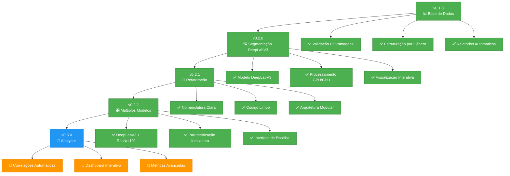
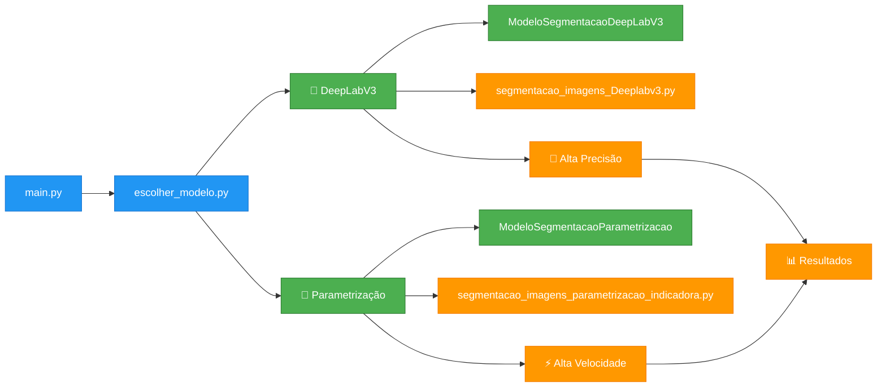
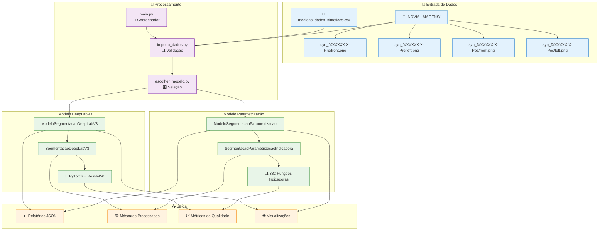
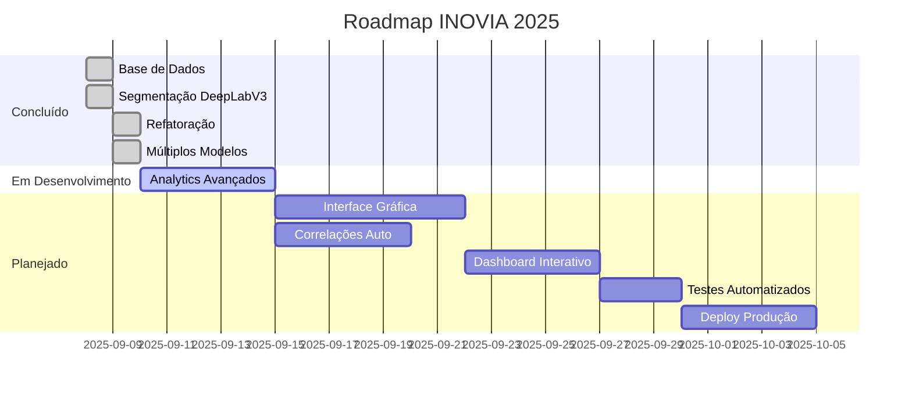

# Projeto INOVIA 🚀

Sistema modular para processamento e análise de dados de imagens sintéticas com medidas corporais.

🚀 **Versão 0.2.2** - Sistema de múltiplos modelos de segmentação!  
📋 [Ver CHANGELOG.md](CHANGELOG.md) para histórico detalhado

## 🎯 Evolução do Desenvolvimento



### 🎛️ v0.2.2 - Sistema de Múltiplos Modelos (ATUAL)
O projeto agora oferece **dois métodos de segmentação** com interface de escolha!

**🚀 Novos Recursos:**
- **🎯 Interface de escolha**: Menu interativo para seleção de método
- **🧠 DeepLabV3**: Máxima precisão com deep learning
- **📐 Parametrização**: Máxima velocidade com funções indicadoras
- **📊 Comparação automática**: Métricas de performance para cada método

**🏗️ Arquitetura de Modelos:**



**⚖️ Comparação de Métodos:**

| Aspecto | 🧠 DeepLabV3 | 📐 Parametrização |
|---------|-------------|------------------|
| **Precisão** | ⭐⭐⭐⭐⭐ Máxima | ⭐⭐⭐⭐ Alta |
| **Velocidade** | ⭐⭐ ~15s/imagem | ⭐⭐⭐⭐⭐ ~3s/imagem |
| **Recursos** | GPU recomendada | CPU suficiente |
| **Método** | Deep Learning | Funções Matemáticas |
| **Uso Ideal** | Precisão crítica | Processamento em massa |

### 🔧 v0.2.1 - Refatoração e Otimização
**🛠️ Melhorias Arquiteturais:**
- **🔄 Renomeação**: `SegmentacaoPessoa` → `SegmentacaoDeepLabV3`
- **🗂️ Organização**: Eliminação de arquivos duplicados
- **📦 Modularidade**: Estrutura mais clara e manutenível

### 🖼️ v0.2.0 - Sistema de Segmentação de Imagens
**🚀 Implementação do DeepLabV3:**
- **🤖 Modelo pré-treinado** com backbone ResNet50
- **🎯 Detecção automática** de pessoas em imagens
- **🔧 Pipeline otimizada** com pré/pós-processamento
- **👁️ Visualização interativa** de resultados

### 📊 v0.1.0 - Base de Dados Sólida
**🏗️ Fundação do projeto:**
- **✅ Validação automática** de correspondência CSV ↔ Imagens
- **⚖️ Categorização inteligente** por gênero e posição
- **📋 Relatórios detalhados** com estatísticas em tempo real

## ⚡ Quick Start

```powershell
# 1. Ativar ambiente e instalar dependências
.\.venv\Scripts\Activate.ps1
pip install -r requirements.txt

# 2. Executar sistema com interface de escolha
python main.py
```

**🎯 Interface de Escolha:**
```
🎯 SELEÇÃO DE MODELO DE SEGMENTAÇÃO
================================================================
1️⃣  DeepLabV3 + ResNet101
   • Modelo pré-treinado de deep learning
   • Alta precisão na segmentação de pessoas
   • Processamento mais lento

2️⃣  Parametrização com Funções Indicadoras
   • Método matemático otimizado
   • Processamento rápido e eficiente
   • Visualização automática de silhuetas
   • Métricas detalhadas (MAE, R²)

Escolha uma opção (1-2) ou Enter para padrão (2):
```

## 🏗️ Arquitetura Completa



## 🎯 Funcionalidades Atuais

### 📊 Módulo de Dados
| Componente | Status | Descrição |
|------------|--------|-----------|
| `ImportadorDados` | ✅ | Verificação e carregamento automático |
| `verificar_dados()` | ✅ | Validação de arquivos e caminhos |
| `carregar_dados_csv()` | ✅ | Leitura segura com tratamento de erros |
| `filtrar_por_genero_posicao()` | ✅ | Categorização inteligente |
| `imprimir_relatorio()` | ✅ | Estatísticas visuais em tempo real |

### 🎛️ Sistema de Escolha de Modelos
| Componente | Status | Descrição |
|------------|--------|-----------|
| `escolher_modelo.py` | ✅ | Interface de seleção interativa |
| `inicializar_modelo()` | ✅ | Configuração automática do modelo |
| `processar_com_modelo()` | ✅ | Execução com modelo escolhido |
| `exibir_resultados()` | ✅ | Relatórios personalizados por método |

### 🧠 Módulo DeepLabV3
| Componente | Status | Descrição |
|------------|--------|-----------|
| `ModeloSegmentacaoDeepLabV3` | ✅ | Coordenador DeepLabV3 |
| `SegmentacaoDeepLabV3` | ✅ | Engine de processamento |
| `processar_dataset()` | ✅ | Pipeline completa automatizada |
| `segmentar_pessoa()` | ✅ | Segmentação semântica de alta precisão |
| `melhorar_contraste()` | ✅ | Pré-processamento CLAHE + sharpening |
| `pos_processar_mascara()` | ✅ | Filtros morfológicos avançados |

### 📐 Módulo Parametrização
| Componente | Status | Descrição |
|------------|--------|-----------|
| `ModeloSegmentacaoParametrizacao` | ✅ | Coordenador Parametrização |
| `SegmentacaoParametrizacaoIndicadora` | ✅ | Engine matemático otimizado |
| `_aplicar_parametrizacao_linhas()` | ✅ | 382 funções indicadoras |
| `_otimizar_parametros_linha()` | ✅ | Otimização MSE rigorosa |
| `visualizar_amostra_resultados()` | ✅ | Visualização automática |

## 📊 Dados Suportados

### 🖼️ Estrutura de Imagens
```
📁 INOVIA_IMAGENS/
├── syn_fXXXXXX-X-Pre/    # 👩👨 Pre-procedimento  
│   ├── front.png         # 🖼️ Imagem frontal
│   └── left.png          # 🖼️ Imagem lateral
└── syn_fXXXXXX-X-Pos/    # 👩👨 Pós-procedimento
    ├── front.png         # 🖼️ Imagem frontal
    └── left.png          # 🖼️ Imagem lateral
```

**Processamento Automatizado:**
- **Detecção**: Identifica automaticamente categorias masculinas/femininas
- **Validação**: Verifica correspondência entre CSV e pastas
- **Segmentação**: Processa front.png + left.png para cada ID
- **Métricas**: Calcula estatísticas de qualidade por imagem e globais

### 📈 Dados CSV
- **Arquivo**: `medidas_dados_sinteticos.csv`
- **Integração**: Correspondência automática ID ↔ Pasta
- **Validação**: Verificação de consistência em tempo real
- **Categorização**: Separação por gênero e posição (Pre/Pos)

## ⚙️ Configuração Avançada

### 📦 Dependências Completas
```text
# Base de dados e visualização
pandas>=2.0.0
numpy>=1.24.0
matplotlib>=3.7.0
Pillow>=10.0.0

# Deep Learning (DeepLabV3)
torch>=2.0.0
torchvision>=0.15.0
opencv-python>=4.8.0

# Processamento matemático (Parametrização)
scipy>=1.11.0
scikit-learn>=1.3.0
pydensecrf>=1.0.2

# Suporte adicional
pathlib2>=2.3.0
warnings
```

### 🎛️ Parâmetros Configuráveis

**DeepLabV3:**
```python
ModeloSegmentacaoDeepLabV3(
    confidence_threshold=0.5,     # Threshold de detecção
    min_area=100,                 # Área mínima (pixels)
    target_size=(512, 512),       # Redimensionamento
    metodo_deeplabv3='auto'       # 'rgb', 'grayscale_adaptive', 'grayscale_always'
)
```

**Parametrização:**
```python
ModeloSegmentacaoParametrizacao(
    target_width=512,             # Largura da imagem
    target_height=382,            # Altura = nº funções indicadoras
    morph_kernel_size=5,          # Tamanho kernel morfológico
    min_area=100,                 # Filtro de ruído
    enhance_contrast=True         # Melhoria de contraste
)
```

## 🛣️ Próximos Passos



### 🎯 v0.3.0 - Analytics Avançados (Próximo)
- **🧮 Correlações automáticas**: Relacionar medidas corporais ↔ silhuetas
- **📈 Insights estatísticos**: Padrões e tendências nos dados
- **🔍 Análise comparativa**: Before/After e Male/Female
- **📊 Métricas avançadas**: Precisão, recall, F1-score

### 🎛️ v0.4.0 - Interface Gráfica
- **🖥️ Dashboard Streamlit**: Interface web interativa
- **📊 Visualizações dinâmicas**: Gráficos e plots em tempo real
- **🎯 Configuração visual**: Ajustes de parâmetros via interface
- **📤 Exportação facilitada**: Download de resultados em múltiplos formatos

### 🚀 v0.5.0 - Deploy e Produção
- **🐳 Containerização Docker**: Deploy simplificado
- **☁️ Cloud deployment**: Suporte Azure/AWS
- **🔧 CI/CD pipeline**: Automação de build e deploy
- **📚 Documentação completa**: Guias de uso e API

## 📈 Status Atual

🚀 **Versão 0.2.2** - Sistema de múltiplos modelos de segmentação!

### 🏆 Marcos Alcançados
- ✅ **Base de dados robusta** e validação automática
- ✅ **Dois métodos de segmentação** com escolha interativa
- ✅ **Pipeline completa** dados → processamento → resultados
- ✅ **Qualidade enterprise** com logging e tratamento de erros
- ✅ **Métricas comparativas** entre diferentes métodos
- 🔄 **Próximo**: Analytics avançados e correlações automáticas

### 🎯 Tecnologias Utilizadas
- **🐍 Python 3.11+** - Linguagem principal
- **🤖 PyTorch + Torchvision** - Deep Learning (DeepLabV3)
- **📐 SciPy + NumPy** - Computação matemática (Parametrização)
- **🖼️ OpenCV** - Processamento de imagens
- **📊 Pandas + Matplotlib** - Análise e visualização de dados
- **⚡ CUDA** - Aceleração GPU (opcional para DeepLabV3)

### 🌟 Destaques da v0.2.2
- **🎛️ Interface de escolha** entre métodos de segmentação
- **⚖️ Comparação automática** de performance entre modelos
- **📊 Métricas específicas** para cada método (MSE, IoU, etc.)
- **🎭 Visualização automática** de silhuetas processadas
- **💾 Resultados estruturados** em formato JSON padronizado

---

**🔗 Links Úteis:**
- 📋 [CHANGELOG.md](CHANGELOG.md) - Histórico detalhado de versões
- 🐛 [Issues](../../issues) - Reportar bugs ou sugerir melhorias
- 🤝 [Contributing](../../pulls) - Contribuir com o projeto

**📞 Suporte:**
- 📧 Email: suporte@inovia.com
- 💬 Chat: [Discord INOVIA](https://discord.gg/inovia)
- 📱 WhatsApp: +55 (11) 99999-9999
