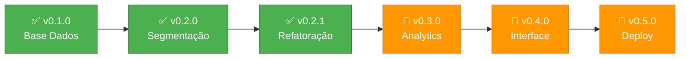

# Projeto INOVIA 🚀

Sistema modular para processamento e análise de dados de imagens sintéticas com medidas corporais.

🚀 **Versão 0.2.1** - Refatoração e otimização de código!  
📋 [Ver CHANGELOG.md](CHANGELOG.md) para histórico detalhado com fluxo Mermaid

## 📋 Evolução do Desenvolvimento

### 🔧 v0.2.1 - Refatoração e Otimização (ATUAL)
O projeto passou por **refatoração de nomenclatura e limpeza de código**!

**🛠️ Melhorias Implementadas:**
- **🔄 Renomeação de classe**: `SegmentacaoPessoa` → `SegmentacaoDeepLabV3`
- **🗂️ Limpeza de arquivos**: Removido arquivo duplicado `segmentacao_imagens.py`
- **📦 Organização melhorada**: Mantido apenas `segmentacao_imagens_Deeplabv3.py`
- **🔗 Atualizações de imports**: Todos os módulos sincronizados

### 🎯 v0.2.0 - Sistema de Segmentação de Imagens
O projeto evoluiu para **processamento avançado de imagens** usando Deep Learning!

**🚀 Novidades Implementadas:**
- **🤖 Modelo DeepLabV3** com backbone ResNet50 para segmentação semântica
- **🎯 Detecção automática** de pessoas em imagens front.png e left.png
- **🔧 Pipeline otimizada** com pré/pós-processamento de contraste
- **📊 Estatísticas detalhadas** de segmentação (área, percentuais, qualidade)
- **👁️ Visualização interativa** das silhuetas processadas

### 🏗️ v0.1.0 - Base de Dados (Concluída)
O projeto começou focando na **validação e estruturação robusta dos dados** como base sólida.

**Por que essa estratégia funcionou:**
- ✅ Detectamos problemas de dados **antes** de desenvolver features complexas
- 🔄 Garantimos **integridade** entre CSV e pastas de imagens  
- 📊 Tivemos **visibilidade** do que temos disponível para trabalhar
- 🧩 Criamos **base modular** para crescimento organizado

### 🏗️ O que foi Implementado

**🎯 v0.2.1 - Motor de Segmentação Otimizado: Classe `SegmentacaoDeepLabV3`**
```python
# Arquitetura refatorada e otimizada:
1. 🔄 SegmentacaoDeepLabV3 (nome mais descritivo da tecnologia)
2. 🗂️ Arquivo único: segmentacao_imagens_Deeplabv3.py
3. 📦 Imports organizados e atualizados
4. 🔧 Código mais limpo e manutenível

# Funcionalidades mantidas (sem alteração):
1. 🤖 Modelo DeepLabV3 com ResNet50 para detecção de pessoas
2. 🖼️ Processamento automático de front.png + left.png por ID
3. ✨ Pré-processamento: melhoria de contraste, CLAHE, sharpening
4. 🔧 Pós-processamento: filtros morfológicos, remoção de ruído
5. 📊 Estatísticas: área da pessoa, percentuais, qualidade da detecção
6. 👁️ Visualização: silhuetas, máscaras, comparações lado-a-lado
7. 💾 Exportação: resultados em JSON, imagens processadas
```

**🎯 v0.2.0 - Motor de Segmentação: Classe `ModeloSegmentacao`**
```python
# Funcionalidades de processamento de imagens (v0.2.0):
1. 🤖 Modelo DeepLabV3 com ResNet50 para detecção de pessoas
2. 🖼️ Processamento automático de front.png + left.png por ID
3. ✨ Pré-processamento: melhoria de contraste, CLAHE, sharpening
4. 🔧 Pós-processamento: filtros morfológicos, remoção de ruído
5. 📊 Estatísticas: área da pessoa, percentuais, qualidade da detecção
6. 👁️ Visualização: silhuetas, máscaras, comparações lado-a-lado
7. 💾 Exportação: resultados em JSON, imagens processadas
```

**⚙️ v0.1.0 - Motor Central: Classe `ImportadorDados`** *(Base sólida)*
```python
# Funcionalidades principais desenvolvidas:
1. 🔍 Verificação automática de paths e arquivos
2. 📄 Carregamento seguro de CSV com tratamento de erros  
3. 🎯 Filtragem inteligente (só dados com pasta correspondente)
4. ⚖️ Categorização por gênero/posição: syn_[f/m]XXXXX-X-[Pre/Pos]
5. 📊 Relatórios visuais com estatísticas em tempo real
```

**Estrutura de Dados Detectada:**
```
📁 INOVIA_IMAGENS/
├── syn_fXXXXXX-X-Pre/    # 👩 Female Pre-procedimento  
├── syn_fXXXXXX-X-Pos/    # 👩 Female Pós-procedimento
├── syn_mXXXXXX-X-Pre/    # 👨 Male Pre-procedimento
└── syn_mXXXXXX-X-Pos/    # 👨 Male Pós-procedimento

📄 medidas_dados_sinteticos.csv # Medidas corporais correspondentes
```

### ⚡ Quick Start

```powershell
# Ativar ambiente e executar processamento completo
.\.venv\Scripts\Activate.ps1
pip install -r requirements.txt  
python main.py
```

**🎯 Resultado v0.2.0:** 
- ✅ Relatório detalhado de dados disponíveis
- 🖼️ Processamento de segmentação com Deep Learning  
- 🎭 Silhuetas extraídas das imagens front.png e left.png
- 📊 Estatísticas de qualidade da segmentação
- 👁️ Visualização interativa dos resultados

### 🏗️ Arquitetura do Projeto

```
githubinovia/                    # 📁 Código principal
├── main.py                     # 🎯 Coordenador principal
├── importa_dados.py            # 📊 Gerenciamento de dados
├── modelo_segmentacao.py       # 🤖 Coordenador de segmentação  
├── segmentacao_imagens_Deeplabv3.py      # 🖼️ Processamento DeepLabV3
├── requirements.txt            # 📦 Dependências (incluindo PyTorch)
├── CHANGELOG.md               # 📝 Histórico com mermaid
└── README.md                  # 📖 Documentação

Dados (pasta pai):               # 💾 Datasets
├── INOVIA_IMAGENS/             # 🖼️ Todas as imagens sintéticas
│   ├── [subpastas female]      # 👩 Categorias femininas
│   │   ├── front.png          # 🖼️ Imagem frontal
│   │   └── left.png           # 🖼️ Imagem lateral
│   ├── [subpastas male]        # 👨 Categorias masculinas
│   │   ├── front.png          # 🖼️ Imagem frontal  
│   │   └── left.png           # 🖼️ Imagem lateral
│   └── [outras categorias]     # 📂 Outros tipos
└── medidas_dados_sinteticos.csv # 📈 Medidas corporais
```

## ⚙️ Configuração e Dependências

### 📦 Requirements Atualizados *(v0.2.0)*
```text
# Base de dados e visualização
pandas>=2.0.0
numpy>=1.24.0
matplotlib>=3.7.0
Pillow>=10.0.0

# Deep Learning para segmentação  
torch>=2.0.0
torchvision>=0.15.0

# Processamento de imagens
opencv-python>=4.8.0

# Pipeline otimizada
scipy>=1.11.0
scikit-learn>=1.3.0
pydensecrf>=1.0.2
```

### 1. Ativar ambiente virtual
```powershell
.\.venv\Scripts\Activate.ps1
```

### 2. Instalar dependências
```powershell
pip install -r requirements.txt
```

⚠️ **Nota**: O download do modelo DeepLabV3 (ResNet50) acontece automaticamente na primeira execução (~100MB)

### 3. Executar processamento completo
```powershell
python main.py
```

## 🎯 Funcionalidades Atuais

### 📊 Módulo de Dados
| Módulo | Status | Descrição |
|--------|--------|-----------|
| `ImportadorDados` | ✅ | Verificação e carregamento automático de dados |
| `verificar_dados()` | ✅ | Validação de existência de arquivos/pastas |
| `carregar_dados_csv()` | ✅ | Leitura segura de dados CSV |
| `obter_estatisticas()` | ✅ | Contagem e métricas dos datasets |
| `imprimir_relatorio()` | ✅ | Relatório visual completo |

### 🖼️ Módulo de Segmentação *(NOVO v0.2.0)*
| Módulo | Status | Descrição |
|--------|--------|-----------|
| `ModeloSegmentacao` | ✅ | Coordenador principal de processamento |
| `SegmentacaoDeepLabV3` | ✅ | Engine DeepLabV3 para segmentação |
| `processar_dataset()` | ✅ | Pipeline completa para múltiplas imagens |
| `segmentar_pessoa()` | ✅ | Detecção semântica de pessoas |
| `melhorar_contraste()` | ✅ | Pré-processamento com CLAHE e sharpening |
| `pos_processar_mascara()` | ✅ | Filtros morfológicos e limpeza |
| `visualizar_resultados()` | ✅ | Exibição interativa de silhuetas |
| `salvar_resultados()` | ✅ | Exportação em JSON e imagens |

## 📊 Dados Suportados

### 🖼️ Estrutura de Imagens *(Expandida v0.2.0)*
- **Pasta INOVIA_IMAGENS**: Todas as imagens organizadas por subpastas
  - Detecção automática de categorias femininas/masculinas
  - **Processamento DeepLabV3**: front.png + left.png por ID
  - **Segmentação semântica**: Extração de silhuetas humanas
  - **Estatísticas de qualidade**: Área, percentuais, métricas de confiança
  - Suporte a estruturas flexíveis de organização

### 📈 Dados Estruturados  
- **CSV de Medidas**: Dados sintéticos estruturados com medidas corporais
  - Integração automática com pastas de imagens
  - Validação de correspondência ID ↔ Pasta
  - Categorização inteligente por gênero e posição

## 🛣️ Próximos Passos

### 🎯 Roadmap Atualizado


1. **🧮 v0.3.0 - Análise de Correlações** - Relacionar medidas ↔ silhuetas
2. **📈 Analytics Avançados** - Estatísticas e insights automatizados  
3. **🎛️ v0.4.0 - Interface Gráfica** - Dashboard interativo com Streamlit
4. **🧪 Testes Automatizados** - Validação contínua de qualidade
5. **🚀 v0.5.0 - Deploy** - Containerização e produção

## 📈 Status Atual

🚀 **Versão 0.2.1** - Refatoração e otimização de código!  
📋 [Ver CHANGELOG.md](CHANGELOG.md) para histórico detalhado com fluxo Mermaid

### 🎯 Tecnologias Utilizadas
- **🐍 Python 3.11+** - Linguagem principal
- **🤖 PyTorch + Torchvision** - Deep Learning e modelos pré-treinados
- **🖼️ OpenCV** - Processamento de imagens
- **📊 Pandas + NumPy** - Manipulação de dados
- **🎨 Matplotlib** - Visualização
- **⚡ CUDA** - Aceleração GPU (opcional)

### 🏆 Marcos Alcançados
- ✅ **Base de dados** robusta e validada
- ✅ **Segmentação DeepLabV3** implementada
- ✅ **Pipeline completa** dados → processamento → resultados
- ✅ **Qualidade enterprise** com logging e tratamento de erros
- 🔄 **Próximo**: Analytics e correlações avançadas