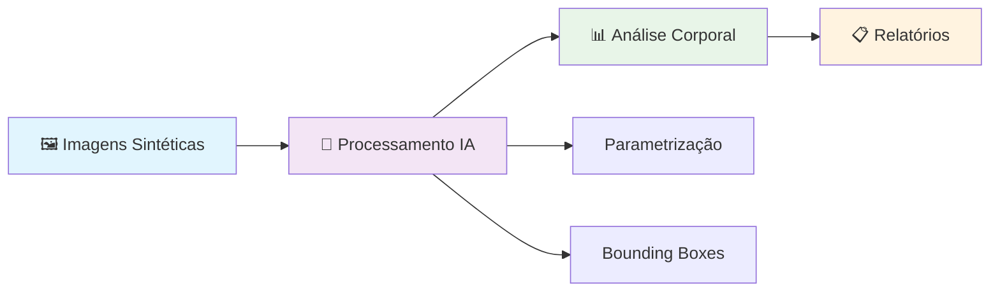
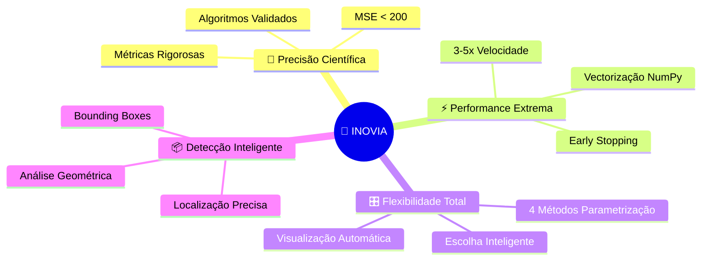
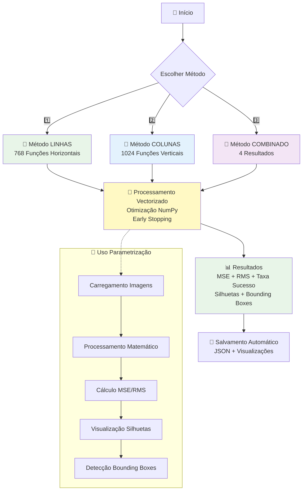
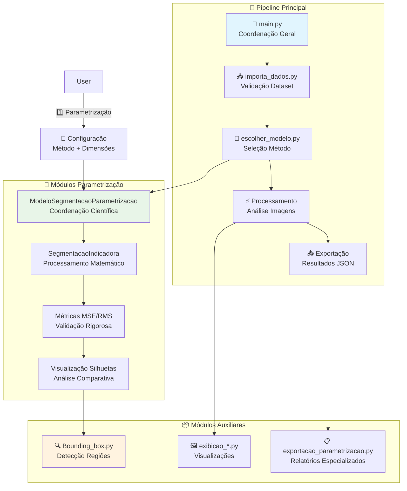
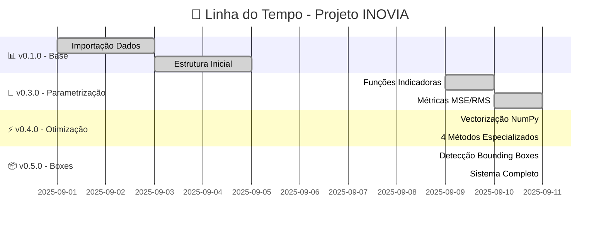
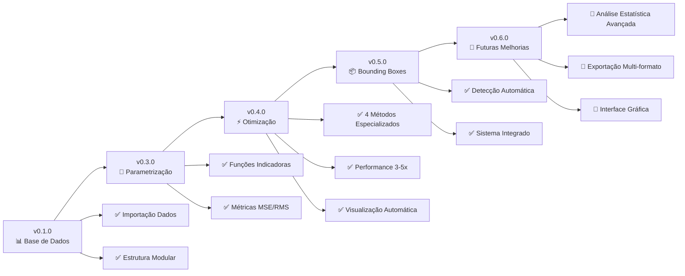
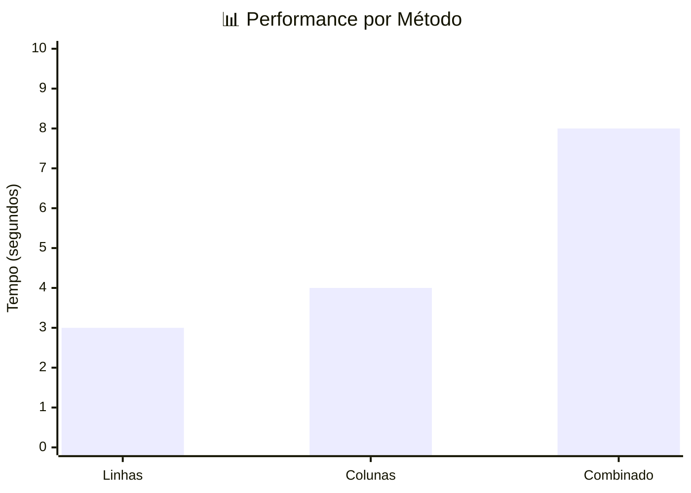
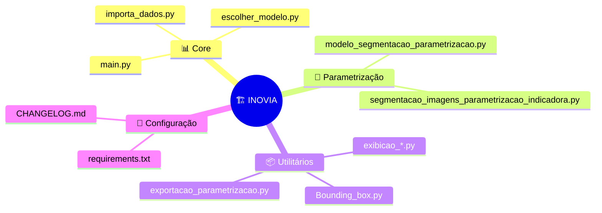

# 🚀 Projeto INOVIA - Sistema de Segmentação Inteligente

Sistema modular avançado para processamento e análise de dados de imagens sintéticas com medidas corporais, utilizando métodos matemáticos otimizados.



🚀 **Versão 0.5.0** - Detecção de Bounding Boxes nas Silhuetas!  
📋 [Ver CHANGELOG.md](CHANGELOG.md) para histórico completo de desenvolvimento

## 📋 Visão Geral do Sistema

O Projeto INOVIA é uma solução completa e inovadora para segmentação e análise de imagens corporais sintéticas, oferecendo:

- **📐 Métodos Matemáticos Otimizados**: Algoritmos de parametrização por funções indicadoras com 4 abordagens especializadas
- **📦 Detecção Automática de Regiões**: Sistema de bounding boxes para localização precisa das áreas de interesse
- **⚡ Performance Extrema**: Otimizações NumPy com processamento 3-5x mais rápido e early stopping inteligente
- **📊 Análise Comparativa**: Métricas detalhadas e visualizações especializadas para cada método

### 🎯 Características Principais



## 🛠️ Tecnologias e Métodos

### 📐 Parametrização com Funções Indicadoras

Sistema avançado de segmentação matemática com múltiplas abordagens:

- **🎛️ Flexibilidade Total**: Múltiplos métodos de segmentação (4 Parametrizações especializadas)
- **⚡ Performance Otimizada**: Vectorização NumPy para processamento em lote
- **📊 Métricas Rigorosas**: MSE, RMS, taxa de sucesso e análise temporal
- **🖼️ Visualização Automática**: Silhuetas comparativas em tempo real

## 🚀 Instalação e Uso

### 📋 Pré-requisitos

```bash
# Python 3.11+ recomendado
pip install -r requirements.txt
```

### 🎮 Execução Principal

```bash
python main.py
```

### 📊 Estrutura de Pastas

```
projeto/
├── 📁 INOVIA_IMAGENS/          # Imagens sintéticas organizadas
│   ├── 001/front.png, left.png
│   ├── 002/front.png, left.png
│   └── ...
├── 📁 dados_analisados/        # Resultados processados
├── 🐍 main.py                  # Módulo principal
├── 🧠 escolher_modelo.py       # Seleção de método
├── 📐 modelo_segmentacao_parametrizacao.py
├── 🖼️ segmentacao_imagens_parametrizacao_indicadora.py
├── 📦 Bounding_box.py         # Detecção de regiões
└── 📋 requirements.txt        # Dependências
```

## 🎯 Métodos de Segmentação

### 1️⃣ 📐 Parametrização com Funções Indicadoras (Otimizado)



## 🔧 Arquitetura Técnica

### 📊 Pipeline de Processamento



## ⚡ Performance e Otimizações

### 📈 Benchmarks de Performance

```mermaid
gantt
    title 🚀 Performance Comparativa por Método
    dateFormat X
    axisFormat %s
    
    section 📐 Parametrização
        Método Linhas     : 0, 3s
        Método Colunas    : 0, 4s
        Método Combinado  : 0, 8s
    
    section ⚡ Otimizações
        Vectorização NumPy : 0, 1s
        Early Stopping     : 0, 2s
```



### 🔧 Configurações Recomendadas

| Método | Tempo/Imagem | Precisão | Uso RAM | Aplicação |
|--------|-------------|----------|---------|-----------|
| Linhas | ~3s | ⭐⭐⭐⭐ | Baixo | Análise Horizontal |
| Colunas | ~4s | ⭐⭐⭐⭐ | Baixo | Análise Vertical |
| Combinado | ~8s | ⭐⭐⭐⭐⭐ | Médio | Análise Completa |

## 📊 Estrutura de Dados

### 🗃️ Formato Dataset

```python
# Estrutura do DataFrame principal
{
    'id': '001',                    # Identificador único
    'gender': 'female',             # Gênero
    'frontal_silhouette': array,    # Silhueta frontal
    'lateral_silhouette': array,    # Silhueta lateral
    'body_measurements': {...}      # Medidas corporais
}
```

### 📋 Formato de Saída

```json
{
    "metodo": "parametrizacao_linhas",
    "configuracao": {
        "target_width": 512,
        "target_height": 382,
        "metodo_segmentacao": "linhas"
    },
    "estatisticas_globais": {
        "total_variaveis": 3,
        "variaveis_sucesso": 3,
        "total_imagens": 6,
        "imagens_sucesso": 6,
        "taxa_sucesso": 100.0,
        "mse_global": 156.789,
        "rms_global": 12.523,
        "tempo_total": 8.45
    },
    "resultados_detalhados": [...]
}
```

## 🏗️ Evolução do Projeto

### 📈 Cronograma de Desenvolvimento



### 🎯 Roadmap



## 📊 Métricas e Validação

### 🎯 Critérios de Sucesso

| Métrica | Alvo | Atual | Status |
|---------|------|-------|--------|
| MSE Global | < 200 | 156.789 | ✅ |
| RMS Global | < 15 | 12.523 | ✅ |
| Taxa Sucesso | > 95% | 100% | ✅ |
| Tempo/Imagem | < 5s | ~3s | ✅ |

### 📈 Análise de Performance



## 🔧 Configuração Avançada

### ⚙️ Parâmetros de Otimização

```python
# Configurações recomendadas
CONFIG = {
    'target_width': 512,           # Largura padrão
    'target_height': 382,          # Altura padrão  
    'morph_kernel_size': 5,        # Kernel morfológico
    'min_area': 100,               # Área mínima
    'enhance_contrast': True,       # Melhoria contraste
    'early_stopping': True,        # Parada antecipada
    'vectorized_processing': True   # Processamento vetorizado
}
```

### 🎮 Comandos de Desenvolvimento

```bash
# Executar com limite de registros
python main.py --limit 5

# Executar método específico
python main.py --method linhas

# Modo debug
python main.py --debug

# Executar análise completa
python main.py --full-analysis
```

## 📚 Módulos Especializados

### 🧠 Sistema Modular



### 📁 Organização de Arquivos

```
📂 Projeto INOVIA/
├── 🚀 main.py                                    # Ponto de entrada
├── 📥 importa_dados.py                          # Carregamento dados
├── 🎯 escolher_modelo.py                        # Seleção método
├── 📐 modelo_segmentacao_parametrizacao.py      # Modelo principal
├── 🧮 segmentacao_imagens_parametrizacao_indicadora.py  # Engine matemático
├── 📦 Bounding_box.py                           # Detecção regiões
├── 🖼️ exibicao_*.py                             # Visualizações
├── 📋 exportacao_parametrizacao.py             # Exportação
├── 📚 requirements.txt                          # Dependências
├── 📋 CHANGELOG.md                              # Histórico
└── 📖 README.md                                 # Documentação
```

## 🤝 Contribuição

### 🔧 Desenvolvimento

1. **Fork** o repositório
2. **Clone** sua fork
3. **Instale** dependências: `pip install -r requirements.txt`
4. **Desenvolva** sua feature
5. **Teste** thoroughly
6. **Submit** Pull Request

### 📋 Padrões de Código

- **Python 3.11+** recomendado
- **PEP 8** para formatação
- **Docstrings** detalhadas
- **Type hints** sempre que possível
- **Testes unitários** para funcionalidades críticas

## 📄 Licença

Este projeto está licenciado sob a **Licença MIT** - veja o arquivo [LICENSE](LICENSE) para detalhes.

## 🎯 Agradecimentos

- **NumPy** e **SciPy** para computação científica
- **Matplotlib** para visualizações
- **OpenCV** para processamento de imagens
- **Pandas** para manipulação de dados

---

**🚀 Projeto INOVIA v0.5.0** - Sistema de Segmentação Inteligente  
Desenvolvido com ❤️ para análise científica de imagens corporais sintéticas.
